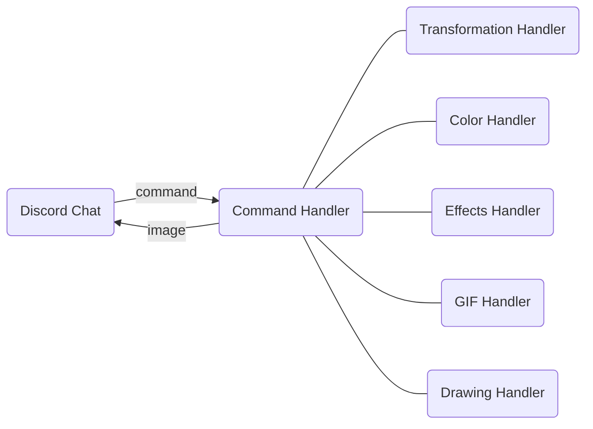
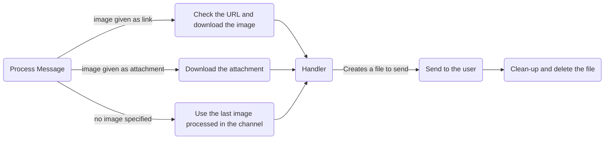

# Image Bot

## Table of Contents
1. [Introduction](#introduction)
2. [Available Commands](#available-commands)
    1. [Meta Commands](#meta-commands)
    2. [Transformations](#transformations)
    3. [Color Filters](#color-filters)
    4. [Effects](#effects)
    5. [GIFs](#gifs)
3. [Development Environment Setup](#development-environment-setup)
4. [Architecture Overview](#architecture)

## Introduction
Edit your images in Discord with Image Bot! This bot provides a cross-platform way to apply a lot of effects, filters, and other transformations to your images. 

While [there](https://top.gg/bot/1012419466031792188) are [many](https://discord.bots.gg/bots/780570413767983122) other [image](https://discordbotlist.com/bots/assyst) editing [Discord]((https://discord.bots.gg/bots/732654582089515009)) bots on the market, Image Bot is free, open-source, and feature-rich. It's easy to deploy and to expand upon. 

Many existing image bots seek to provide highly complex functionality with simple inputs, such as allowing the creation of a fake Donald Trump tweet with a single message. This convenience comes at the cost of flexibility, which our bot seeks to address by providing many simple image adjustments that are often overlooked by other bots.

Additionally, this bot serves as a useful demonstration delivery method for our more complex image transformations, such as the triangulate method.
## Available Commands
All commands are prefixed with `$`. Additionally, note that the url argument is optional. By default, if no url is provided, then the most recently sent url in the channel is used.
### Meta Commands
1. `$help`
Provides a list of commands and arguments.
2. `$echo`
The bot echos back an image unchanged.
### Transformations
1. `$scale [factor] [url]`
Scales the provided image by the given amount. The factor must be positive. Additionally, neither height nor width of the resulting image can be greater than 65500 pixels.
2. `resize [width] [height] [url]`
Resizes the image to the given width and height. Likewise, neither height nor width of the resulting image can be greater than 65500 pixels.
3. `$rotate [degree] [url]`
Rotates the image by the given degrees counterclockwise. Negative values rotate clockwise
4. `$flip [direction] [url]`
If direction is 1, then the image is flipped vertically such that the top is at the bottom. If direction is 0, then the image is flipped horizontally.
5. `$compress [rate] [url]`
Compresses a JPEG by the specified rate between 0 and 1, inclusive. Image file size decreases as the compression rate goes down. Beware that information is lost during compression.
6. `$edge_detect [url]`
Converts the image to a black and white image, where edges detected in the original image are colored white.
7. `$to_ascii [color] [url]`
Tranforms the image to an ascii art. If color is 0, the ascii art is monochromatic. If color is 1, it is chromatic.
8. `$sharpen [level] [url]`
Sharpens the image by the given level from 1 to 4. The higher the level is, the sharper the image becomes.
### Color Filters
1. `$grayscale [url]`
Returns a grayscale version of the given image.
### Effects
1. `$triangulate [points] [url]`
Returns a triangulated version of an image.
    * `points` - integer in range [1, 16383) specifying how many samples from the image to take
2. `$tri_animate [url]`
Creates a gif with a triangulation effect.
3. `$voronoi [points] [seed] [url]`
Filters the image with a voronoi diagram
    * `points` - an integer in the range [4, 32768]
    * `seed` - seed for random number generation
4. `$voronoi_animate [seed] [url]`
Creates a gif with a voronoi effect
    * `seed` - seed for random number generation

Returns a gif with a triangulation effect.
### GIFs
1. `$create_gif ["image_url1 image_url2 ... image_urln"] [cover_image_url]`
Creates a gif from input images and the cover image. If input images have different dimensions, all are resized to the dimension of cover_image.
2. `$append_gif ["image_url1 image_url2 ... image_urln"] [gif_url]`
Appends input images to the given gif. If input images have different dimensions, all are resized to the dimension of the gif. Appending images can be gifs.

### Image Drawing
1. `$pick_color [r] [g] [b]`
Picks the color to be used by future commands, given by the selected color channels, taking values between 0 and 255, inclusive. Note that values outside of this range with be taken modulo 256. It also sends back a swatch of the selected color.
2. `$sample_color [num_colors] [url]`
Picks the dominant color in the image to be used by future commands, given it is divided into the [num_colors] most dominant colors. This is accomplished using k-means clustering. It also sends back a swatch of the selected color.
3. `$line [x1] [y1] [x2] [y2] [width] [url]`
Draws a line from point (x1, y1) to (x2, y2) with the given width of the saved color. Arguments must be integers, and width must be positive. Note that the coordinates are given such that (0, 0) is in the top left corner
4. `$rect [x1] [y1] [x2] [y2] [width] [url]`
Draws a rectangle bounded by the points (x1, y1), (x2, y2) of the saved color.

## Development Environment Setup
1. Follow the instructions [here](https://discord.com/developers/docs/getting-started) to set up your bot and get your bot token. Don't share this with anyone!

2. Install Python 3.8 or higher

3. Clone the repository
    ```
    git clone https://github.com/CS222-UIUC/Team0-ImageBot
    ```
4. Set up your virtual environment
    ```
    cd Team0-ImageBot
    python3 -m venv bot-env
    ```
    Activate the virtual environment.

    * (MacOS/Linux)
        ```
        source bot-env/bin/activate
        ```
    * (Windows)
        ```
        bot-env\Scripts\activate.bat
        ```

5. Install necessary stuff
    ```
    pip install -r requirements.txt
    ```
    Be sure to update this file if you install a new library.

6. For testing locally, create a file called `BOT_TOKEN.txt`, and paste your bot's token into there. 

    If hosting on Heroku, then go to the app's `Settings > Config Vars`. Add one with the key `"IMAGE_BOT_TOKEN"`, and put the bot token into the value.

7. To run the bot locally, run
    ```
    python3 main.py
    ```
    and `Ctrl+C` to stop.

## Architecture
For this project, we chose to use Python. The language is both simple and familiar, and it has large selection of libraries to choose from, making it easy to quickly build up our project. 


### Discord Chat
Users can interact with the bot by entering commands, as described in the [Available Commands](#available-commands) section. After processing it, the bot will then send back the image or GIF.

For interfacing with Discord, we're using version 2.1.1 of the popular [discord.py](https://discordpy.readthedocs.io/en/stable/) library.

Files:
* `main.py`
* `image_utils.py`
* `cogs/*.py`

Contributors:
* [Brendan](https://github.com/BrendanParmer)
* [Daniel](https://github.com/dsding2)
* [Jason](https://github.com/Jason717717)
* [Adrian](https://github.com/Ulico)


### Command Handler
The Command Handler is broadly responsible for processing the command string and the image sent by the user, as well as returning the result given by the appropriate handler. 

In general, a command goes through the following steps


Downloading the image mostly uses the `urllib` library, which we use for setting a user-agent, checking to see if the link is an image, and actually downloading the image. The `os` library is used for handling filenames, directory creation, creating files, and deleting them. 

Files:
* `image_utils.py`

Contributors:
* [Brendan](https://github.com/BrendanParmer)
* [Daniel](https://github.com/dsding2)
* [Jason](https://github.com/Jason717717)
* [Adrian](https://github.com/Ulico)

### Handlers
The bulk of the bot's functionality is taken care of by the handlers. The bot was designed to make it easy to add on new handlers with ease.

Each handler has two files associated with it, located in the following directories:
1. `cogs`: interface to register the Discord command and handle any errors that come up.
2. `utils`: the actual logic that processes an image. 
    * These files contain classes that derive from a base `Command` class, which requires each component to implement a `usage` string and a `command` function with an `img_path` argument

Files:
* `command.py`
#### Transformation Handler

#### Color Handler

#### Effects Handler
The triangulation effect is created using the [triangler](https://github.com/tdh8316/triangler) library by [Donghyeok Tak](https://github.com/tdh8316). 

The voronoi effect is created by taking a random sample of pixels with `numpy`, and uses `scipy`'s `griddata` function to get the nearest of these samples for every pixel in the picture, effectively creating voronoi cells.

The GIF effects are created by changing the number of points used in each frame, while keeping the seeds constant to keep temporal coherence. The `os` and `shutil` modules were especially useful for file creation and deletion here. 

OpenCV is also used, mostly to get images into a clean format before processing. Pillow and Matplotlib are used for opening and saving images. 

Files:
* `cogs/effect_commands.py` - Listens for effect commands, and handles errors
* `utils/effect.py` - Contains classes for applying effects to images

Contributors:
* [Brendan](https://github.com/BrendanParmer)

#### GIF Handler

#### Drawing Handler
All of the drawing effects are handled through cv2, which opens, draws, and saves the image.

The sample color command picked the most dominant color based on k-means clustering, also provided by cv2.
